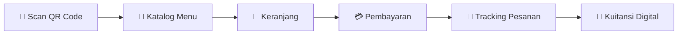
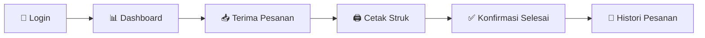
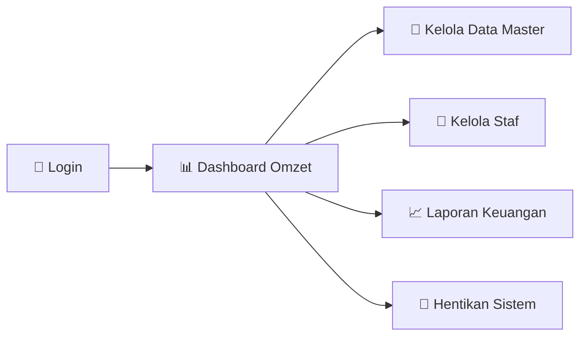
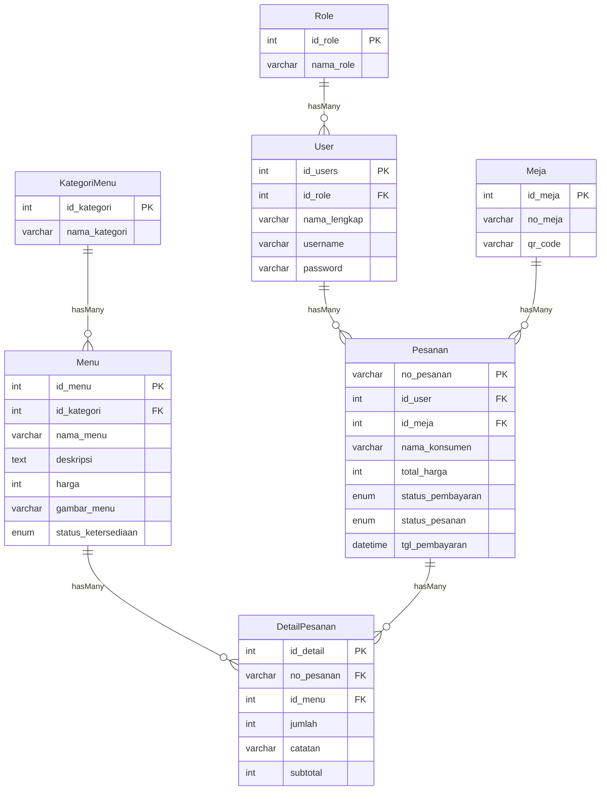

# 📋 Product Requirement Document (PRD)

> **Nama Proyek:** Sistem Informasi Pemesanan Menu (SIMPEN)
> **Platform:** Web (Mobile via QR Code untuk Konsumen & Desktop untuk Admin/Kasir)
> **Metodologi:** Agile Kanban (Initiative → Analysis → Design → Develop → Testing) via Trello
> **Studi Kasus:** Kafe Kohvito

---

## 1. Pendahuluan & Tujuan Proyek

Proyek ini bertujuan untuk membangun sebuah **sistem pemesanan menu makanan dan minuman mandiri (seamless)** yang dapat meminimalisir antrean panjang di kasir.

Pelanggan **tidak perlu mengunduh aplikasi**; cukup memindai QR Code di meja, melihat katalog digital, memesan, membayar secara online, dan melacak pesanan.

Sistem ini juga bertujuan:

- **Mempermudah operasional kasir** dalam mengeksekusi pesanan.
- **Membantu admin kafe** mengelola data master dan mencetak laporan transaksi secara terintegrasi.

---

## 2. Pengguna Sistem (Aktor)

Sistem ini memfasilitasi **tiga tipe pengguna**:

| Aktor        | Deskripsi                                                                      |
| ------------ | ------------------------------------------------------------------------------ |
| **Konsumen** | Pengguna akhir yang memesan dan membayar hidangan secara mandiri.              |
| **Kasir**    | Staf operasional yang menerima pesanan masuk dan mengonfirmasi penyelesaian.   |
| **Admin**    | Pemilik/supervisor yang mengelola data master, akun staf, dan laporan keuangan.|

---

## 3. Alur Aplikasi (End-to-End Workflow)

### A. Alur Konsumen (Front-End)

1. **Akses (Scan QR Code)**
   Konsumen duduk di meja dan memindai QR Code. Sistem mendeteksi **ID meja** dan langsung mengarahkan konsumen ke halaman katalog menu *(tanpa proses login atau daftar)*.

2. **Katalog & Keranjang**
   Konsumen melihat gambar, deskripsi, dan harga. Konsumen menekan **"Tambah ke Keranjang"**, lalu mengatur jumlah porsi dan menginput *notes* kustomisasi (misal: *"tidak pedas"*).

3. **Pemesanan (Checkout)**
   Konsumen meninjau keranjang dan menekan tombol **Pesan**.

4. **Pembayaran**
   Konsumen dialihkan ke halaman **Payment Gateway** untuk memilih metode pembayaran digital dan membayar tagihan.

5. **Tracking Pesanan & Kuitansi**
   Setelah pembayaran sukses, konsumen dialihkan ke halaman **Tracking**:
   - `Menunggu Konfirmasi` → `Diproses` → `Selesai`
   - Konsumen juga dapat **mengunduh Struk/Kuitansi digital**.

---

### B. Alur Kasir (Back-End / Dapur)

1. **Login**
   Kasir masuk menggunakan **username** dan **password**.

2. **Dashboard & Kelola Pesanan**
   Kasir memantau papan pesanan masuk. Saat ada pesanan yang berhasil dibayar konsumen, kasir menekan **Terima Pesanan**, mencetak struk untuk diteruskan ke dapur, lalu memperbarui status pesanan menjadi `"Diproses"`.

3. **Konfirmasi Selesai**
   Saat hidangan siap diantar, kasir mengubah status pesanan menjadi `"Selesai"` *(otomatis ter-update di layar konsumen)*.

4. **Histori Pesanan**
   Kasir dapat mencari, melihat, dan mencetak rekap histori pesanan harian yang sudah selesai atau dibatalkan.

---

### C. Alur Admin (Back-End Manajemen)

1. **Login & Dashboard**
   Admin login dan melihat **ringkasan omzet** atau operasional.

2. **Kelola Data Master**
   Admin melakukan **penambahan, perubahan, dan penghapusan** data:
   - Menu
   - Kategori Menu
   - Meja / QR Code

3. **Kelola Staf**
   Admin mengelola (*Tambah, Edit, Hapus*) username dan password **Kasir**.

4. **Laporan Keuangan**
   Admin dapat menyaring tanggal (*filter*) dan mengunduh/cetak laporan omzet penjualan kafe secara utuh dalam bentuk dokumen.

5. **Hentikan Sistem**
   Jika kafe terlalu penuh, Admin dapat menekan tombol untuk **memberhentikan sementara pemesanan** dari QR Code.

---

## 4. Class Diagram (Struktur MVC)

Aplikasi dikembangkan dengan **Framework Laravel**. Struktur sistem dibagi menjadi **Model** (Representasi Data) dan **Controller** (Logika Fungsi).

### A. Controller Classes

#### Akses Umum

| Controller         | Method                                 |
| ------------------ | -------------------------------------- |
| `AuthController`   | `create()`, `store()`, `authenticated()` |

#### Modul Admin

| Controller                    | Method                                              |
| ----------------------------- | --------------------------------------------------- |
| `BerandaAdminController`      | `index()`, `getData()`, `cetakLaporanKasir()`       |
| `KelolaMenuController`        | `index()`, `storeMenu()`, `updateMenu()`, `destroyMenu()` |
| `KelolaKategoriMenuController`| `index()`, `storeKategoriMenu()`, `destroyKategoriMenu()` |
| `KelolaPenggunaKasirController`| `index()`, `storePenggunaKasir()`, `destroyPenggunaKasir()` |

#### Modul Kasir

| Controller                | Method                                                              |
| ------------------------- | ------------------------------------------------------------------- |
| `BerandaKasirController`  | `index()`                                                           |
| `KelolaPesananController` | `index()`, `detail()`, `updateStatus()`, `cetakPesanan()`           |
| `HistoriPesananController`| `index()`, `detail()`, `cetakHistoriPesanan()`, `cetakSemuaHistoriPesanan()` |

#### Modul Konsumen

| Controller                  | Method                                                                                |
| --------------------------- | ------------------------------------------------------------------------------------- |
| `BerandaKonsumenController` | `index()`, `getData()`, `detail()`                                                    |
| `KeranjangKonsumenController`| `index()`, `storeTambahKeranjang()`, `updateNotesPesanan()`, `updatePesanan()`, `storePesan()` |
| `BayarController`           | `bayar()`, `callback()`                                                               |
| `PesananController`         | `index()` *(halaman tracking dan struk digital)*                                      |

---

### B. Model Classes & Relasi

| Model            | Relasi                                                     |
| ---------------- | ---------------------------------------------------------- |
| `Role`           | `hasMany` → User                                          |
| `User`           | `belongsTo` → Role · `hasMany` → Pesanan                  |
| `Meja`           | `hasMany` → Pesanan                                        |
| `KategoriMenu`   | `hasMany` → Menu                                           |
| `Menu`           | `belongsTo` → KategoriMenu · `hasMany` → DetailPesanan    |
| `Pesanan`        | `belongsTo` → User · `belongsTo` → Meja · `hasMany` → DetailPesanan |
| `DetailPesanan`  | `belongsTo` → Pesanan · `belongsTo` → Menu                |

---

## 5. Desain Basis Data (ERD & Kamus Data)

Database **SIMPEN** dirancang dengan **7 tabel** yang saling terhubung:

### Tabel `role`

| Field        | Tipe Data | Keterangan                                      |
| ------------ | --------- | ----------------------------------------------- |
| `id_role`    | INT (PK)  | Primary Key                                     |
| `nama_role`  | VARCHAR   | Memisahkan hak akses sistem (Admin atau Kasir)  |

### Tabel `users`

| Field           | Tipe Data | Keterangan                                          |
| --------------- | --------- | --------------------------------------------------- |
| `id_users`      | INT (PK)  | Primary Key                                         |
| `id_role`       | INT (FK)  | Foreign Key → `role.id_role`                        |
| `nama_lengkap`  | VARCHAR   | Nama lengkap staf                                   |
| `username`      | VARCHAR   | Username untuk login                                |
| `password`      | VARCHAR   | Password (hashed)                                   |

### Tabel `meja`

| Field      | Tipe Data | Keterangan                                          |
| ---------- | --------- | --------------------------------------------------- |
| `id_meja`  | INT (PK)  | Primary Key                                         |
| `no_meja`  | VARCHAR   | Nomor identitas meja                                |
| `qr_code`  | VARCHAR   | Jalur gambar QR Code untuk di-scan konsumen          |

### Tabel `kategori_menu`

| Field            | Tipe Data | Keterangan                                       |
| ---------------- | --------- | ------------------------------------------------ |
| `id_kategori`    | INT (PK)  | Primary Key                                      |
| `nama_kategori`  | VARCHAR   | Nama kelompok menu (Misal: Kopi, Makanan Berat)  |

### Tabel `menu`

| Field                  | Tipe Data                           | Keterangan                         |
| ---------------------- | ----------------------------------- | ---------------------------------- |
| `id_menu`              | INT (PK)                            | Primary Key                        |
| `id_kategori`          | INT (FK)                            | Foreign Key → `kategori_menu.id_kategori` |
| `nama_menu`            | VARCHAR                             | Nama produk menu                   |
| `deskripsi`            | TEXT                                | Deskripsi produk                   |
| `harga`                | INT                                 | Harga produk (dalam Rupiah)        |
| `gambar_menu`          | VARCHAR                             | Path gambar produk                 |
| `status_ketersediaan`  | ENUM (`Tersedia`, `Tidak Tersedia`) | Status ketersediaan produk         |

### Tabel `pesanan` *(Tabel Induk)*

| Field                | Tipe Data                                                  | Keterangan                                                             |
| -------------------- | ---------------------------------------------------------- | ---------------------------------------------------------------------- |
| `no_pesanan`         | VARCHAR (PK)                                               | Primary Key — format otomatis: `KVT-SQC-Date-Time-001`                |
| `id_user`            | INT (FK, Nullable)                                         | Foreign Key → `users.id_users`                                         |
| `id_meja`            | INT (FK)                                                   | Foreign Key → `meja.id_meja`                                           |
| `nama_konsumen`      | VARCHAR                                                    | Nama konsumen yang memesan                                             |
| `total_harga`        | INT                                                        | Total tagihan pesanan                                                  |
| `status_pembayaran`  | ENUM (`menunggu`, `lunas`)                                 | Status pembayaran                                                      |
| `status_pesanan`     | ENUM (`menunggu konfirmasi`, `diproses`, `selesai`)        | Status tracking pesanan                                                |
| `tgl_pembayaran`     | DATETIME                                                   | Tanggal & waktu pembayaran                                             |

### Tabel `detail_pesanan` *(Tabel Anak)*

| Field          | Tipe Data    | Keterangan                                          |
| -------------- | ------------ | --------------------------------------------------- |
| `id_detail`    | INT (PK)     | Primary Key                                         |
| `no_pesanan`   | VARCHAR (FK) | Foreign Key → `pesanan.no_pesanan`                  |
| `id_menu`      | INT (FK)     | Foreign Key → `menu.id_menu`                        |
| `jumlah`       | INT          | Jumlah porsi yang dipesan                           |
| `catatan`      | VARCHAR      | Notes kustomisasi (misal: *"tidak pedas"*)          |
| `subtotal`     | INT          | Subtotal harga (harga × jumlah)                     |

---

> [!NOTE]
> PRD ini sudah selaras dengan pendekatan alur penelitian. Dokumen ini dapat digunakan langsung sebagai **acuan dasar** untuk masuk ke tahap **Develop (Pengkodean Program Laravel)**.
