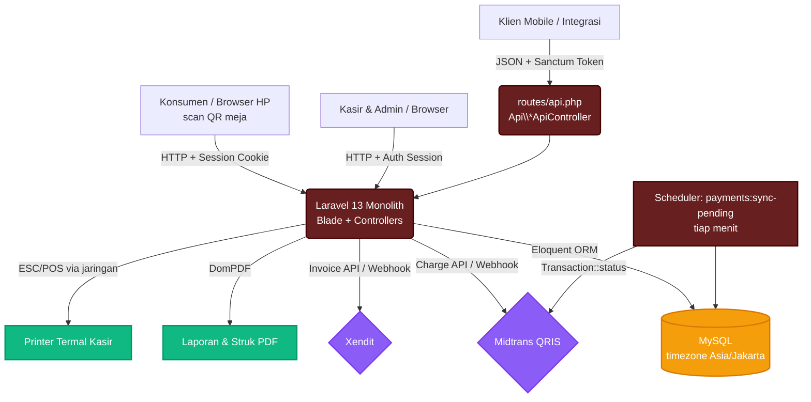
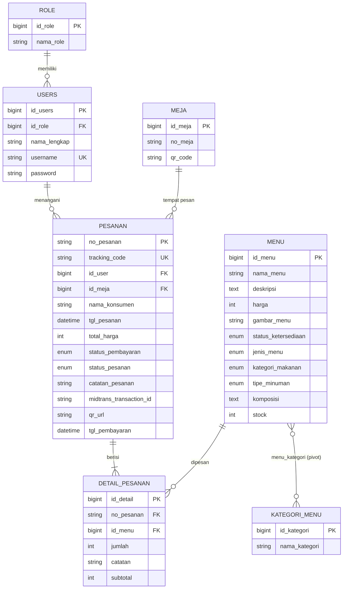

# SIMPEN-PRD — Project Requirements Document

> **SIMPEN (Sistem Pemesanan) — Kafe Kohvito.**
> Dokumen ini adalah sumber kebenaran (source of truth) kebutuhan produk untuk aplikasi pemesanan
> dine-in Kafe Kohvito. Ditulis agar Junior Developer / pengembang selanjutnya dapat memahami
> **apa** yang dibangun dan **mengapa**, sebelum membaca kodenya. Pasangan dokumen ini adalah
> `SIMPEN-Design.md` (sistem desain UI) dan `PANDUAN-PAYMENT-GATEWAY.md` (setup pembayaran).

## 1. Overview

Kafe dengan sistem pemesanan manual menghadapi tiga masalah klasik: antrean panjang di kasir,
kesalahan pencatatan pesanan oleh pelayan, dan pemilik yang tidak punya data penjualan real-time.

SIMPEN menyelesaikannya dengan alur **scan–pesan–bayar** tanpa aplikasi tambahan: konsumen
memindai QR code yang tertempel di meja, memilih menu dari ponselnya sendiri, membayar melalui
QRIS, dan pesanan otomatis masuk ke antrean dapur/kasir **hanya setelah pembayaran lunas**
(alur *pay-first*). Di sisi internal, kasir mendapatkan antrean pesanan yang selalu valid
(sudah dibayar), sementara admin mendapatkan dashboard omzet, grafik penjualan, menu terlaris,
dan laporan PDF harian — semuanya real-time dari database yang sama.

Prinsip utama produk:

- **Tanpa install** — konsumen hanya butuh browser ponsel; tidak ada login untuk konsumen.
- **Pay-first** — dapur tidak pernah mengerjakan pesanan yang belum dibayar.
- **Satu sumber data** — panel konsumen, kasir, admin, dan superadmin membaca tabel yang sama.
- **Device-independent tracking** — konsumen dapat melacak pesanannya dari perangkat manapun
  lewat kode pelacakan publik (`tracking_code`, format `KV-XXXXX`), tanpa bergantung session/cookie.

## 2. Requirements

- **Pemesanan berbasis konteks meja:** Seluruh alur konsumen wajib membawa identitas meja di URL
  (prefix `/{noMeja}`, format `M01`, `M02`, …). Keranjang terisolasi per meja + per sesi scan
  (*cart scope*) sehingga dua meja atau dua pelanggan pada browser yang sama tidak saling menimpa.
- **Pay-first enforcement:** Pesanan berstatus pembayaran `menunggu` tidak boleh muncul di antrean
  kasir dan tidak boleh bisa ditransisikan statusnya (di-guard di query dan di aksi update status,
  baik web maupun API).
- **Pembayaran multi-driver:** Sistem harus bisa berjalan dengan tiga driver pembayaran yang dipilih
  via `BAYAR_DRIVER` di `.env`: `mock` (simulator lokal, tanpa internet), `midtrans` (QRIS produksi/
  sandbox), dan `xendit` (invoice). Kegagalan webhook tidak boleh membuat status pembayaran hilang —
  ada tiga jaring pengaman: webhook callback, polling dari halaman pembayaran, dan command terjadwal
  `payments:sync-pending` (tiap menit).
- **Role-based access:** Empat aktor — Konsumen (publik, tanpa login), Kasir, Admin, Superadmin.
  Panel internal dilindungi middleware `auth` + `role:{nama}` (`CheckRole`); Superadmin memiliki
  *bypass* ke semua panel.
- **Kontrol operasional:** Admin dapat menutup/membuka pemesanan global secara instan (toggle
  buka/tutup toko, disimpan di cache, dicek middleware `order.status` pada semua route konsumen).
- **Pelaporan:** Admin dapat mengunduh Laporan Kasir PDF dengan filter rentang tanggal; nama file
  menyertakan periode (mis. `laporan-kasir-2026-07-06.pdf`) agar unduhan harian tidak tertukar.
- **Waktu Indonesia:** Seluruh aplikasi berjalan pada timezone `Asia/Jakarta` (WIB / GMT+7),
  diset di `config/app.php`.
- **Keamanan dasar:** Validasi input di semua form/API, CSRF untuk web, Sanctum token untuk API,
  password ter-hash, webhook pembayaran diverifikasi signature (Midtrans) / callback token (Xendit),
  transisi status pesanan memakai state machine (tidak boleh lompat status).
- **Teruji:** Feature test PHPUnit berjalan pada SQLite in-memory (`phpunit.xml`); alur kritis
  (keranjang per meja, pay-first kasir, laporan PDF) memiliki test regresi.

## 3. Core Features

### 3.1 Konsumen (publik, tanpa login)

- **Scan QR & Beranda Menu** — QR di meja mengarah ke `/{noMeja}`. Beranda menampilkan katalog
  menu (nama, harga, gambar, kategori, status ketersediaan) dengan pencarian dan filter kategori.
- **Detail Menu** — komposisi, jenis (Makanan/Minuman), varian (Pedas/Tidak Pedas, Panas/Dingin),
  dan stok.
- **Keranjang Per Meja** — item tersimpan di session dengan key `keranjang.{no_meja}.{cart_scope}`;
  konsumen dapat mengubah jumlah, menambah catatan per item, dan catatan umum pesanan.
- **Checkout** — menghitung Subtotal + PPN 11% = Total. Sistem membangkitkan:
  - `no_pesanan` — primary key string format `PS-YmdHis-XXXX` (contoh `PS-20260706063830-XFIU`),
  - `tracking_code` — kode pelacakan publik format `KV-XXXXX` (5 karakter, tanpa karakter ambigu 0/O/1/I),
  - `tgl_pesanan` — waktu dibuat (diisi otomatis oleh model hook `Pesanan::booted()`).
- **Pembayaran QRIS** — halaman `/pembayaran/{noPesanan}` menampilkan QR, instruksi bayar, unduh QR,
  dan tombol cek status. Status di-poll berkala ke endpoint sync.
- **Lacak Pesanan** — dua jalur: per meja (`/{noMeja}/lacak/{noPesanan}`) dan publik device-independent
  (`/lacak-pesanan` dengan input `tracking_code`). Riwayat kode pelacakan juga disimpan di
  session + cookie backup 30 hari (`riwayat_pesanan_kohvito`).
- **Kuitansi** — halaman kuitansi per pesanan.
- **Batal Pesanan** — hanya jika belum lunas DAN belum dikerjakan dapur; menghapus header + detail
  dalam satu transaksi database.

### 3.2 Kasir

- **Dashboard Kasir** — statistik antrean hari ini (menunggu/diproses/selesai), porsi terjual
  Makanan vs Minuman, rata-rata belanja, menu terlaris harian, chart kepadatan per jam dan
  pendapatan mingguan (Chart.js).
- **Kelola Pesanan (antrean dapur)** — daftar pesanan **lunas** berstatus `menunggu konfirmasi`
  atau `diproses`, urut FIFO berdasarkan waktu bayar. Transisi status memakai **state machine**:
  `menunggu konfirmasi → diproses → selesai` (tidak boleh melompat; pesanan belum lunas ditolak).
- **Cetak Struk** — dua jalur: PDF (DomPDF, preview di browser) dan cetak langsung ke printer
  termal jaringan ESC/POS (`CetakStrukController`).
- **Histori Pesanan** — pencarian transaksi selesai, detail, cetak PDF per pesanan atau semua.

### 3.3 Admin

- **Dashboard Admin** — omzet periode terfilter & bulan berjalan (hanya pesanan `lunas`), total
  transaksi, antrean aktif, menu terlaris (Makanan & Minuman), tabel "Data Pesanan Hari Ini"
  menampilkan **semua** pesanan pada rentang tanggal (dengan badge status pembayaran
  Lunas/Menunggu/Gagal — pesanan belum bayar tetap terlihat tapi tidak menambah omzet),
  chart pesanan per jam dan pendapatan mingguan.
- **Filter Tanggal & Laporan PDF** — filter `tanggal_mulai`/`tanggal_selesai` di dashboard; tombol
  "Cetak Laporan Kasir" membawa filter aktif dan mengunduh PDF berisi transaksi lunas periode tsb.
- **Toggle Buka/Tutup Toko** — menghentikan seluruh pemesanan konsumen secara instan (cache
  `order_status`, dicek middleware `order.status`).
- **Kelola Menu** — CRUD menu dengan multi-kategori (pivot `menu_kategori`), gambar (path storage
  atau URL absolut), stok, status ketersediaan.
- **Kelola Kategori Menu, Kelola Meja (+ cetak QR meja), Kelola Pengguna Kasir** — CRUD standar.

### 3.4 Superadmin

- **Hub semua panel** — launchpad ke panel admin & kasir; middleware `CheckRole` memberi bypass
  penuh (`superadmin` lolos semua pengecekan role).
- **Kelola Admin** — CRUD akun administrator.

### 3.5 Subsistem Pembayaran (lintas-aktor)

| Driver | Kegunaan | Mekanisme konfirmasi |
|---|---|---|
| `mock` | Development lokal tanpa internet | Halaman simulator (`bayar-simulator`) dengan tombol "Tandai LUNAS/GAGAL" |
| `midtrans` | QRIS sandbox/produksi | QR dari Charge API; konfirmasi via webhook `bayar/callback`, polling `pembayaran/{no}/sync`, dan command terjadwal `payments:sync-pending` (tiap menit) |
| `xendit` | Invoice (halaman bayar eksternal) | Redirect ke invoice URL; webhook callback dengan token |

Transisi sukses terpusat di `Pesanan::markAsPaid()`: set `status_pembayaran = lunas`,
`status_pesanan = menunggu konfirmasi` (masuk antrean dapur), `tgl_pembayaran = now()`.
Pesanan yang expire/cancel/deny di gateway ditandai `status_pembayaran = gagal`.

### 3.6 REST API (mobile/integrasi)

`routes/api.php` menyediakan cermin JSON dari fitur web: login Sanctum (`/api/auth/login`),
grup `/api/admin/*` (dashboard, CRUD menu/kategori/kasir, laporan, toggle toko), `/api/kasir/*`
(antrean, update status — dengan guard pay-first yang sama, histori), dan `/api/konsumen/*`
(menu, keranjang, checkout, status, bayar) tanpa autentikasi.

## 4. User Flow

### 4.1 Alur utama konsumen (happy path)

1. **Scan QR meja** → browser membuka `/{noMeja}` (mis. `/M01`). Middleware `order.status` memastikan
   toko sedang buka; session menyimpan konteks meja.
2. **Menjelajah menu** → konsumen mencari/memfilter menu, membuka detail, menambah item ke keranjang
   (keranjang terisolasi per meja + cart scope).
3. **Checkout** → isi nama & catatan, sistem menghitung PPN 11%, membuat `Pesanan` + `DetailPesanan`
   dalam satu transaksi DB, membangkitkan `no_pesanan` + `tracking_code`, membersihkan keranjang meja
   aktif saja, lalu redirect ke halaman pembayaran.
4. **Bayar QRIS** → konsumen memindai QR dengan e-wallet/m-banking. Halaman mem-poll status;
   begitu gateway mengonfirmasi (webhook/polling/scheduler), `markAsPaid()` dijalankan.
5. **Pesanan masuk dapur** → karena sudah `lunas`, pesanan muncul di antrean kasir (FIFO).
   Konsumen diarahkan ke halaman lacak.
6. **Lacak & selesai** → konsumen memantau status (`menunggu konfirmasi → diproses → selesai`)
   dari halaman lacak; kuitansi bisa dibuka kapan saja. Jika berpindah perangkat, gunakan
   `/lacak-pesanan` + `tracking_code`.

**Jalur alternatif:** tidak jadi bayar → pesanan tetap `menunggu`, tidak pernah menyentuh dapur,
akhirnya ditandai `gagal` oleh sync saat expire di gateway; batal → hanya bila belum lunas & belum
dikerjakan.

### 4.2 Alur kasir

1. Login → dashboard statistik.
2. Buka **Kelola Pesanan** → antrean pesanan lunas FIFO.
3. `Terima Pesanan` (→ `diproses`) → kerjakan → `Selesai` (→ `selesai`).
4. Cetak struk (PDF atau printer termal) → pesanan berpindah ke Histori.

### 4.3 Alur admin

1. Login → dashboard omzet & grafik hari ini.
2. (Opsional) filter rentang tanggal → tabel pesanan & omzet mengikuti filter.
3. Unduh Laporan Kasir PDF (mengikuti filter aktif).
4. Kelola master data (menu/kategori/meja/kasir); toggle tutup toko saat tutup operasional.

### 4.4 Siklus status pesanan

```
status_pembayaran : menunggu ──(bayar sukses)──▶ lunas
                    menunggu ──(expire/cancel di gateway)──▶ gagal

status_pesanan    : menunggu konfirmasi ──(kasir: Terima)──▶ diproses ──(kasir: Selesai)──▶ selesai
                    (transisi hanya boleh maju satu langkah, dan hanya untuk pesanan lunas)
```

## 5. Architecture

Aplikasi adalah **monolith Laravel MVC** klasik: Blade sebagai view engine (server-side rendering),
controller per-panel, session-based state untuk konsumen, dan lapisan API JSON terpisah untuk
klien mobile. Tidak ada frontend framework — interaktivitas memakai vanilla JS + library animasi.



Poin arsitektur yang perlu dipahami pengembang baru:

- **Routing berlapis** (`routes/web.php`): route publik konsumen dibungkus prefix dinamis
  `/{noMeja}` dengan constraint `M[0-9]+` dan middleware `order.status`; route aksi per-pesanan
  yang tidak butuh konteks meja (pembayaran, kuitansi, batal, sync) berada di level global;
  panel internal di prefix `admin/`, `kasir/`, `superadmin/` dengan `auth` + `role:*`.
- **State konsumen di session** — keranjang, konteks meja, `no_pesanan_baru`, dan riwayat tracking
  code. Trait `CartSessionScope` mengelola isolasi keranjang.
- **URL lacak terpusat** di `Pesanan::lacakUrl()` — route `konsumen.lacak.detail` butuh dua
  parameter (`noMeja` + `noPesanan`); jangan memanggil `route()` manual untuk halaman lacak.
- **Middleware kustom**: `CheckRole` (alias `role:`) dan `CheckOrderStatus` (alias `order.status`),
  didaftarkan di `bootstrap/app.php`.
- **Scheduler** — jalankan `php artisan schedule:work` di lokal agar `payments:sync-pending` aktif.

## 6. Database Schema

Delapan tabel domain (di luar tabel bawaan Laravel: `sessions`, `cache`, `jobs`,
`personal_access_tokens`). Konvensi: primary key bernama `id_{tabel}`; tabel `pesanan` memakai
primary key **string** `no_pesanan`; mayoritas tabel **tidak memakai timestamps** bawaan Laravel.

- **role** — daftar peran pengguna internal.
  - `id_role` (bigint, PK), `nama_role` (string: Admin / Kasir / Super Admin)
- **users** — akun staf internal (bukan konsumen).
  - `id_users` (bigint, PK), `id_role` (FK → role), `nama_lengkap`, `username` (unique),
    `password` (hashed)
- **meja** — meja fisik kafe, sumber QR code.
  - `id_meja` (bigint, PK), `no_meja` (string, format `M01`), `qr_code` (string)
- **kategori_menu** — kategori menu (mis. Coffee, Non-Coffee, Snack).
  - `id_kategori` (bigint, PK), `nama_kategori`
- **menu** — item jualan.
  - `id_menu` (bigint, PK), `nama_menu`, `deskripsi` (text), `harga` (integer, Rupiah tanpa desimal),
    `gambar_menu` (path storage ATAU URL http absolut — kedua bentuk didukung view),
    `status_ketersediaan` (enum: Tersedia/Tidak Tersedia), `jenis_menu` (enum: Makanan/Minuman),
    `kategori_makanan` (enum nullable: Pedas/Tidak Pedas), `tipe_minuman` (enum nullable:
    Panas/Dingin/Keduanya), `komposisi` (text nullable), `stock` (unsigned int)
- **menu_kategori** — pivot many-to-many menu ↔ kategori.
  - `id_menu` + `id_kategori` (composite PK, FK cascade delete)
- **pesanan** — header transaksi (pusat seluruh alur).
  - `no_pesanan` (string, PK, format `PS-YmdHis-XXXX`), `tracking_code` (string 20, nullable, unique,
    format `KV-XXXXX`), `id_user` (FK → users, nullable — kasir yang menangani),
    `id_meja` (FK → meja), `nama_konsumen`, `tgl_pesanan` (datetime — waktu dibuat, diisi otomatis
    model hook), `total_harga` (integer, sudah termasuk PPN 11%),
    `status_pembayaran` (enum: menunggu/lunas/gagal), `status_pesanan` (enum: menunggu konfirmasi/
    diproses/selesai), `catatan_pesanan` (nullable), `midtrans_transaction_id` (nullable),
    `qr_url` (nullable — URL gambar QRIS dari gateway), `tgl_pembayaran` (datetime nullable —
    hanya terisi saat lunas)
- **detail_pesanan** — baris item per pesanan.
  - `id_detail` (bigint, PK), `no_pesanan` (FK → pesanan), `id_menu` (FK → menu),
    `jumlah` (integer), `catatan` (nullable, per item), `subtotal` (integer)



Catatan penting untuk pengembang:

- **`tgl_pesanan` vs `tgl_pembayaran`** — `tgl_pesanan` = kapan dibuat (selalu terisi);
  `tgl_pembayaran` = kapan lunas (NULL bila belum). Dashboard admin menampilkan daftar pesanan
  berdasarkan `tgl_pesanan`; semua perhitungan **omzet** berdasarkan `status_pembayaran = lunas`
  + `tgl_pembayaran`. Jangan menukar keduanya.
- **Enum `gagal`** hanya ada di MySQL; database test SQLite masih memakai enum lama
  (lihat migration `2026_07_06_000001`, ALTER enum di-guard `DB::getDriverName() === 'mysql'`).
- Harga disimpan sebagai **integer Rupiah** (tanpa desimal) — jangan gunakan float.

## 7. Tech Stack

- **Backend Framework:** Laravel 13 (PHP ≥ 8.3, berjalan di PHP 8.5) — MVC monolith, Eloquent ORM,
  Blade templating, session driver database, timezone `Asia/Jakarta`.
- **Database:** MySQL (development di Laragon); SQLite in-memory khusus test.
- **Frontend:** Blade + Tailwind CSS v4 (konfigurasi CSS-first via `@theme` di
  `resources/css/app.css`), Vite 8 sebagai bundler, vanilla JavaScript.
- **Library UI/JS:** GSAP (animasi), Lottie-web (animasi popup sukses), Typed.js,
  Chart.js 4 via CDN (grafik dashboard admin & kasir).
- **Pembayaran:** `midtrans/midtrans-php` (QRIS Charge API + Transaction status),
  `xendit/xendit-php` (invoice), plus simulator mock internal. Driver dipilih via
  `services.bayar.driver` (`.env: BAYAR_DRIVER`).
- **PDF & Cetak:** `barryvdh/laravel-dompdf` (laporan kasir, struk, histori);
  cetak langsung printer termal jaringan dengan perintah ESC/POS.
- **QR Code:** `simplesoftwareio/simple-qrcode` (QR meja).
- **Export:** `rap2hpoutre/fast-excel` (ekspor Excel).
- **API Auth:** Laravel Sanctum (token) untuk `routes/api.php`.
- **Kualitas kode:** Laravel Pint (formatting), PHPUnit 12 (feature test, SQLite in-memory),
  Faker + factory untuk data test.
- **Perintah penting:**
  - `composer setup` — install + migrate + build sekali jalan.
  - `composer dev` / `composer dev:win` — serve + queue + vite bersamaan.
  - `php artisan schedule:work` — wajib jalan agar sinkronisasi pembayaran Midtrans otomatis.
  - `php artisan test` — jalankan seluruh test.
  - `npm run build` — build ulang asset (wajib setelah menambah class Tailwind baru).
