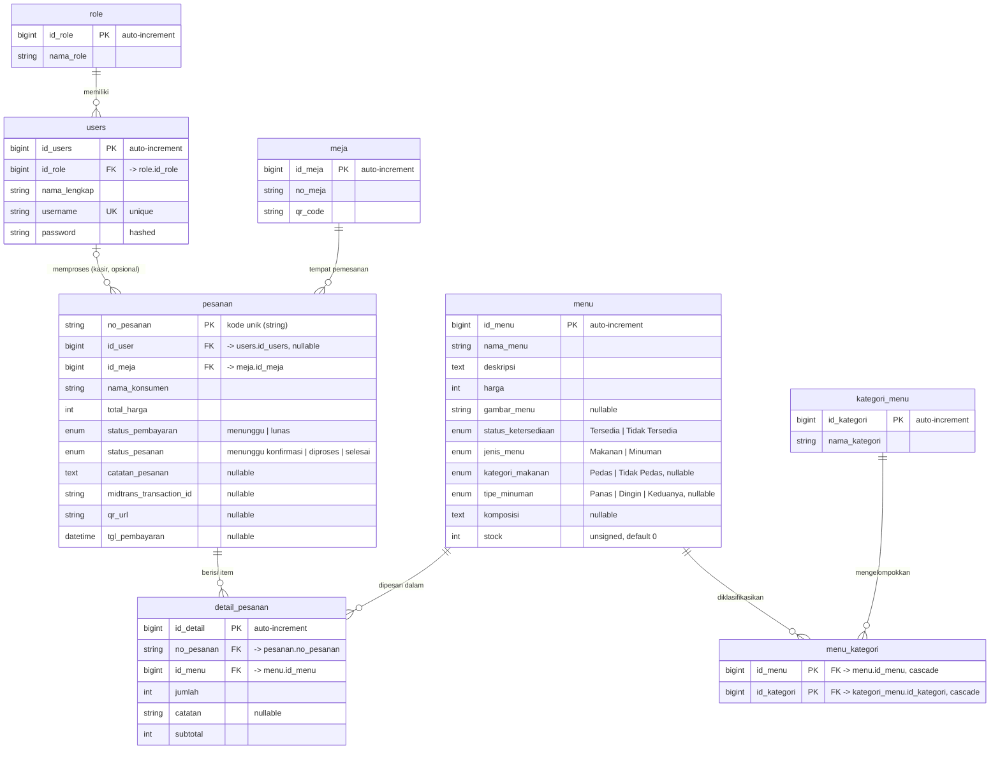

# Entity Relationship Diagram (ERD) — Kohvito Simpen

Sistem pemesanan & kasir kafe (QR table ordering + POS). Dokumen ini
men-dokumentasikan skema database hasil rekonstruksi dari migrations
(`database/migrations`) dan model Eloquent (`app/Models`).

> Tabel framework Laravel (`cache`, `jobs`, `sessions`, `personal_access_tokens`)
> sengaja **tidak** dimasukkan ke ERD domain karena tidak menyimpan data bisnis.
> Catatan: `personal_access_tokens` dipakai Laravel Sanctum untuk autentikasi API.

## Diagram (Mermaid)

## Ringkasan relasi

| Relasi | Kardinalitas | Keterangan |
|---|---|---|
| `role` → `users` | 1 : N | Satu peran (Admin/Kasir/Super Admin) dipakai banyak user. |
| `users` → `pesanan` | 0..1 : N | Kasir yang memproses pesanan. `id_user` nullable — pesanan checkout konsumen belum tentu ditangani kasir. |
| `meja` → `pesanan` | 1 : N | Satu meja menjadi asal banyak pesanan (dine-in via QR). |
| `pesanan` → `detail_pesanan` | 1 : N | Header pesanan memiliki banyak baris item. |
| `menu` → `detail_pesanan` | 1 : N | Satu menu muncul di banyak baris pesanan. |
| `menu` ↔ `kategori_menu` | M : N | Lewat tabel pivot `menu_kategori` (composite PK, cascade delete). |

## Catatan desain skema

- **Primary key non-standar.** Hampir semua tabel memakai PK custom (`id_role`,
  `id_menu`, dst.) alih-alih `id`. `pesanan` memakai PK **string** `no_pesanan`
  (kode transaksi unik, mis. `KOH-260512-XYZ`), bukan auto-increment.
- **Tanpa timestamps.** Seluruh model meng-set `$timestamps = false`; tidak ada
  kolom `created_at` / `updated_at`. Waktu transaksi dilacak via `tgl_pembayaran`.
- **Riwayat migrasi kategori.** Awalnya `menu` punya kolom `id_kategori` (FK
  langsung, 1:N). Sejak `2026_05_16` direfaktor menjadi M:N: kolom di-`drop` dan
  diganti pivot `menu_kategori`.
- **Integrasi pembayaran.** Kolom `midtrans_transaction_id` & `qr_url` di `pesanan`
  untuk gateway QRIS (Midtrans).
- **`password` di-hash otomatis** lewat cast `'hashed'` pada model `User`.
