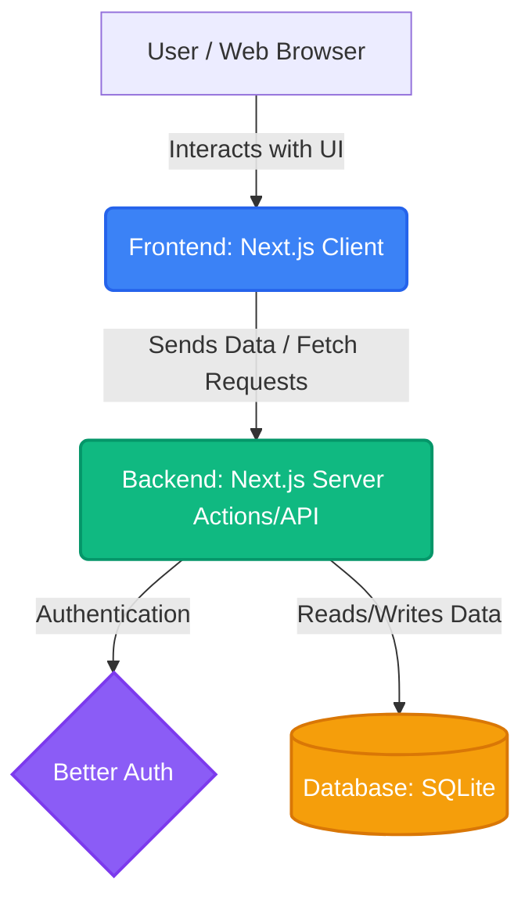
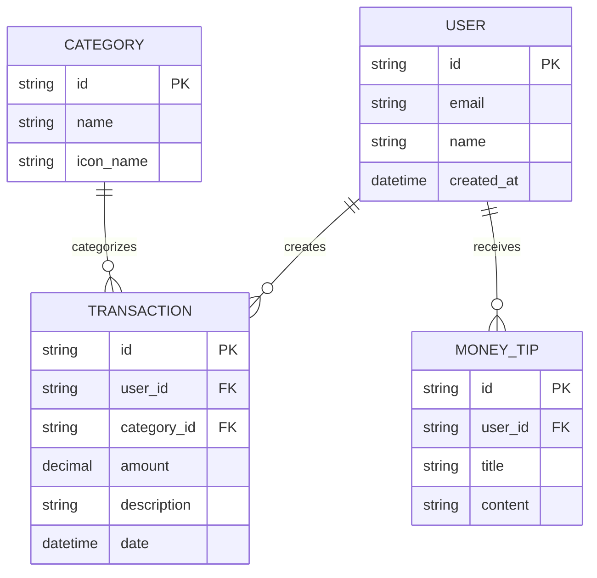

# PRD — Project Requirements Document

## 1. Overview

Managing personal finances can often feel overwhelming and look incredibly boring. Many users struggle to understand where their money goes because existing tools are cluttered or difficult to use.

This application solves that problem by providing an interactive, visually stunning financial app. The main objective is to deliver a clean, modern, card-based interface that makes tracking expenses enjoyable. By instantly showing users their total spending and providing beautiful monthly reports, the app helps users understand their spending habits, visualize category breakdowns, and receive actionable money tips in a highly aesthetic environment.

## 2. Requirements

- **Visually Focused UI/UX:** The primary differentiator is that the app "looks nicer" than competitors. It must use a sleek, modern, card-based design system.
- **Immediate Value:** Users must see their total spending front-and-center the moment they open the app.
- **Recurring Engagement:** The app must generate and highlight a Monthly Report to encourage users to return and review their progress every month.
- **Responsive Design:** The interface must work beautifully across desktop, tablet, and mobile devices.
- **Data Privacy & Security:** Ensure user financial data is securely stored and authenticated.

## 3. Core Features

- **Total Spending Dashboard:** A beautifully designed hero-card that instantly calculates and displays the user's total spending for the current period.
- **Monthly Summary & Reports:** A dedicated, easy-to-read monthly recap that summarizes financial health, keeping users coming back.
- **Interactive Spending Charts:** Clean, visually engaging charts (like donuts or bar graphs) that visualize spending trends over time.
- **Category Breakdown:** A clear division of expenditures (e.g., Food, Rent, Entertainment) so users know exactly where their money is going.
- **Buy History List:** A searchable and scrollable feed of recent transactions, styled like a modern activity feed.
- **Money Tips:** Bite-sized, helpful financial advice and insights surfaced dynamically based on the user's spending behavior.

## 4. User Flow

1. **Onboarding & Authentication:** The user signs up and securely logs into the application.
2. **The "Aha!" Moment:** Upon logging in, the user lands on the main dashboard and instantly sees their _Total Spending_ displayed in a clear, beautiful summary card.
3. **Exploring Data:** The user scrolls down to view their _Buy History List_ to verify recent purchases.
4. **Analyzing Habits:** The user clicks into a "Analytics" tab where they interact with _Spending Charts_ and the _Category Breakdown_ to see which areas consume the most budget.
5. **Review & Learn:** At the end of the month, the user receives a notification to review their _Monthly Summary_ and explores personalized _Money Tips_ to improve their habits for the next month.

## 5. Architecture

The application follows a modern full-stack web architecture. The user accesses the app via a web browser (frontend) which securely communicates with the backend to fetch, process, and store financial data in the database.

## 6. Database Schema

To support the application, we need four primary tables: `User`, `Category`, `Transaction`, and `MoneyTip`.

- **User**: Stores user account details.
  - `id` (String): Unique identifier for the user.
  - `email` (String): User's email address.
  - `name` (String): User's display name.
  - `created_at` (Timestamp): When the account was created.
- **Category**: Stores the transaction categories (e.g., Groceries, Rent).
  - `id` (String): Unique identifier for the category.
  - `name` (String): Name of the category.
  - `icon_name` (String): Reference to the UI icon used for the card interface.
- **Transaction**: Stores individual purchases or incomes.
  - `id` (String): Unique identifier.
  - `user_id` (String): Links the transaction to a specific user.
  - `category_id` (String): Links the transaction to a specific category.
  - `amount` (Decimal): The monetary value of the transaction.
  - `description` (String): Brief detail of the purchase.
  - `date` (Timestamp): When the transaction occurred.
- **MoneyTip**: Stores financial advice to be displayed to users.
  - `id` (String): Unique identifier.
  - `title` (String): The headline of the tip.
  - `content` (String): The detailed advice.

## 7. Tech Stack

Based on the requirement for a modern, visually stunning, and highly responsive platform, the recommended stack is:

- **Frontend Framework:** Next.js (React) — Enables fast loading times, seamless routing, and an interactive user interface.
- **Styling & UI:** Tailwind CSS & shadcn/ui — Perfect for building the required clean, custom, "looks nicer", card-based UI quickly and consistently.
- **Backend:** Next.js (Server Actions / API Routes) — Keeps the codebase unified by allowing the backend logic to live alongside the frontend.
- **Database:** SQLite — Lightweight, fast, and perfect for a streamlined application.
- **ORM (Object Relational Mapper):** Drizzle ORM — Provides a safe, easy-to-read way for the application to communicate with the SQLite database.
- **Authentication:** Better Auth — Ensures secure, effortless login and session management for protecting user financial data.
